# Sistema RSVP para Eventos

## Sobre o Projeto
Sistema de confirmação de presença (RSVP) para eventos, utilizando Django como framework backend e 
Bootstrap para o frontend. O sistema permitirá a gestão de convidados, envio de convites, 
confirmação de presença e controle de check-in no evento.


## Imagens do Sistema

### Tela de Login


### Lista de Eventos
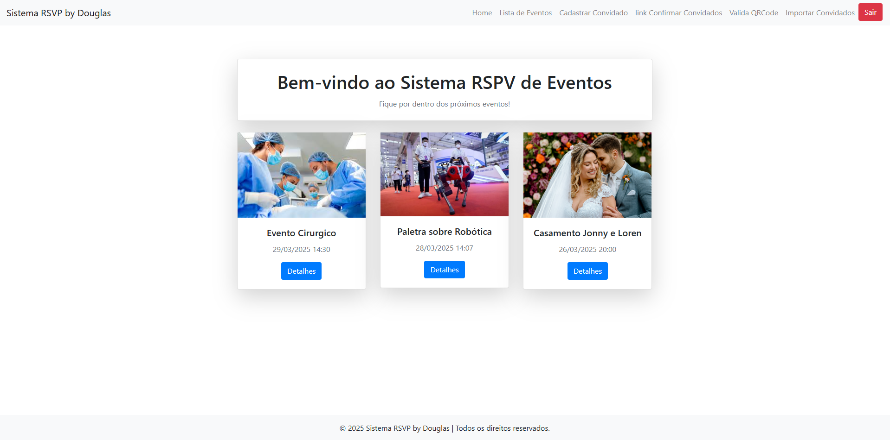

### Lista de Eventos
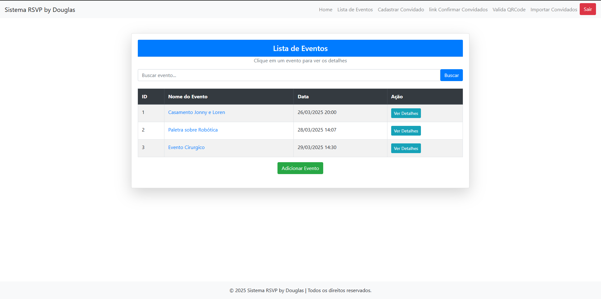

### Detalhe Evento e Convidados
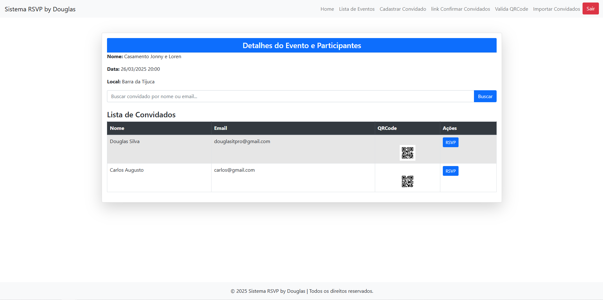


### Detalhe Convidado e Participação
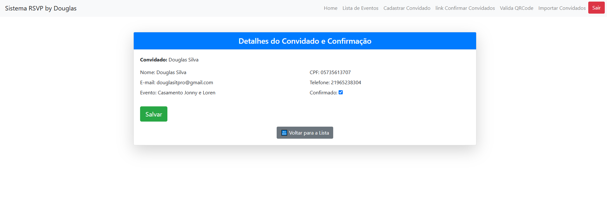


### Cadastrar Convidados
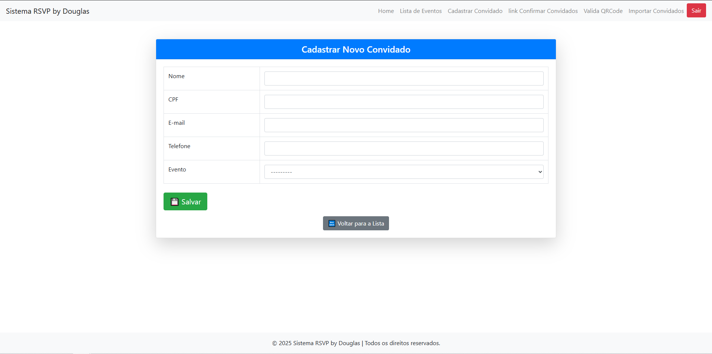

### Importar Convidados
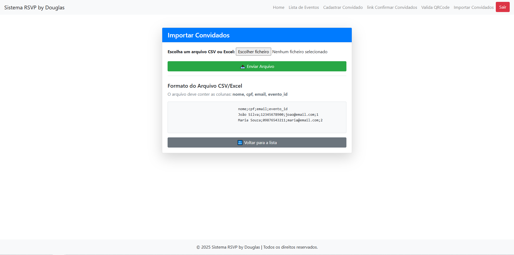


### Confirmação de Presença por CPF
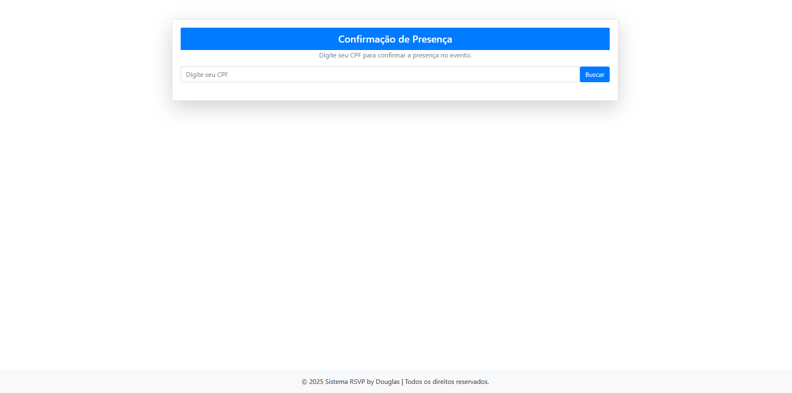

### Confirmação de Presença
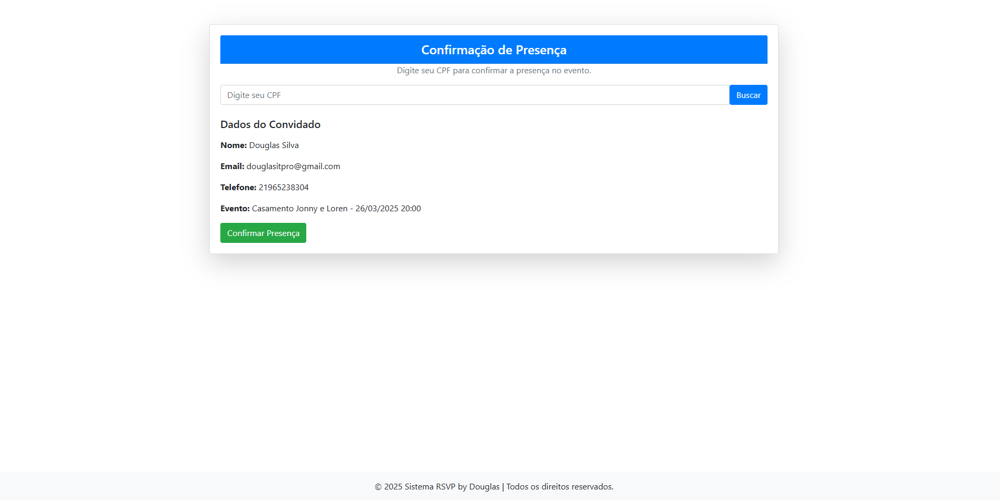

### Presença confirmada e Liberação QRCode
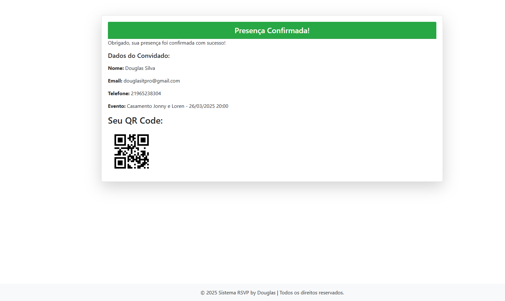

### Verificação de QRCode
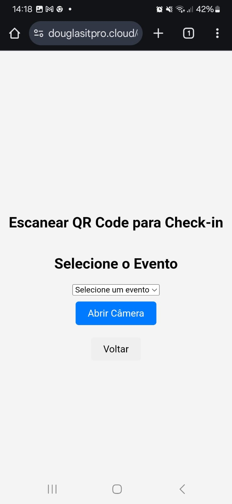

### Analisando QRCode
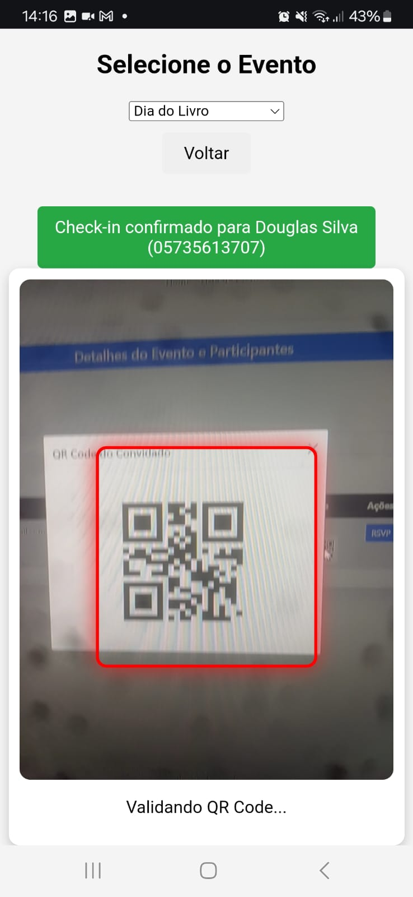

### Analisando QRCode


### Analisando QRCode
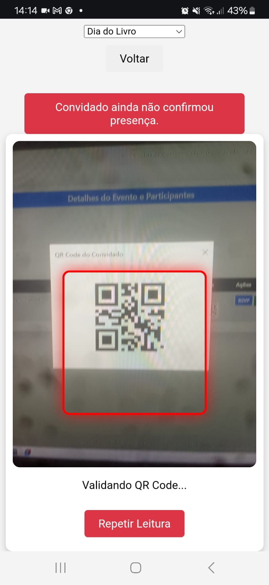


## Funcionalidades Principais
1. **Gerenciamento de Eventos**:
   - Cadastro de eventos
   - Listagem e detalhes dos eventos

2. **Gerenciamento de Convidados**:
   - Cadastro de convidados CPF e emails único.
   - Listagem e detalhamento dos convidados e editar confirmação.

3. **Controle de Acesso do Participante**:
   - Link de participação enviada ao convidado.
   - Participamente confirma participação recebe QRCODE.
   - Verificação do QRCODE do convidados para check-in.

4. **Autenticação e Controle de Acesso**:
   - Login obrigatório para acessar áreas restritas.
   - Somente link para convidados é aberto para usuários não autenticados.

5. **Importação de Dados**:
   - Importação de listas de convidados via arquivos CSV/Excel.
   - Processamento e validação dos dados importados.

6. **APP de autenticação de QRCODE**:
   - APP desenvolvido nativo para autenticação do QRcode dando acesso e registrando checkin-in.

## Estrutura do Projeto
### 1. Models (Banco de Dados)
- `Evento`: Armazena informações sobre os eventos cadastrados.
- `Convidado`: Representa os usuários inscritos no evento.
- `Confirmação`: Informa a participação do convidados ao evento

### 2. Views (Lógica de Negócio)
- `view_name`: Descrição.


### 3. Autenticação
- `Sistema de Login do Django`: Login do sistema utilzando Views.
- Uso do `@login_required` para restringir acesso a funções específicas.

## Tecnologias Utilizadas
- **Django**: Framework principal para desenvolvimento do backend.
- **Django ORM**: Gerenciamento do banco de dados.
- **MySQL**: Banco de dados utilizado.
- **Pandas**: Manipulação de dados para importação via CSV/Excel.
- **Bootstrap**: Estilização das páginas web.
- **Django Authentication**: Gerenciamento de usuários e login.
- **JavaScript**: Validação de QRcode.


## Instalação
### 1 - Clonar o repositório
```bash
git clone https://github.com/douglasinforj/sistema_rspv_presenca_eventos.git
cd sistema-RSVP
```

### 2 - Criar ambiente virtual
```bash
python -m venv venv
source venv/bin/activate  # Linux/Mac
venv\Scripts\activate  # Windows
```

### 3 - Instalar dependências
```bash
pip install -r requirements.txt
```

### 4 - Configurar o banco de dados
Edite o arquivo **.env** e configure as credenciais do PostgreSQL.
```env
DB_NAME=seu_banco
DB_USER=seu_usuario
DB_PASSWORD=sua_senha
DB_HOST=localhost
DB_PORT=3306
SECRET_KEY = 'sua_secret_key'
```

### 5 - Aplicar migrações e criar superusuário
```bash
python manage.py migrate
python manage.py createsuperuser
```

### 6 - Iniciar o servidor
```bash
python manage.py runserver
```
Acesse: [http://127.0.0.1:8000/](http://127.0.0.1:8000/)


## 📄 Licença
Este projeto está sob a licença MIT. Sinta-se à vontade para usá-lo e melhorá-lo! 

---
**Desenvolvido por:** [Douglas R. Silva](https://github.com/douglasinforj) 

